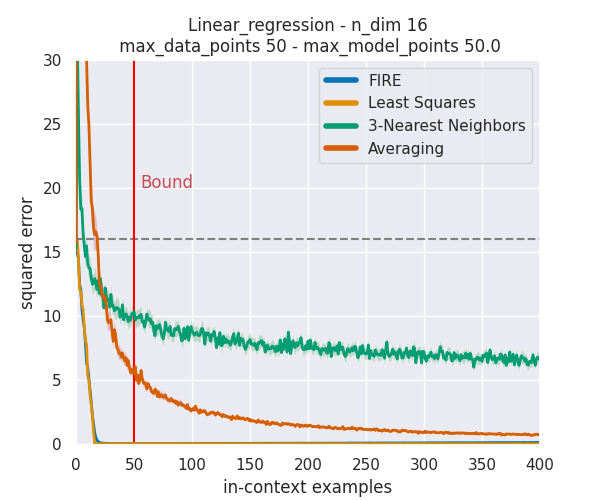
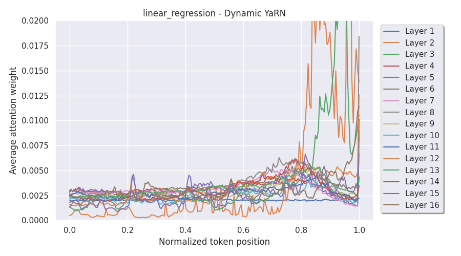
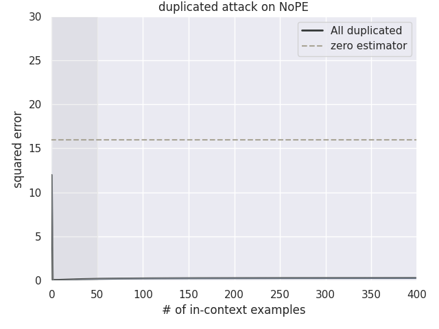
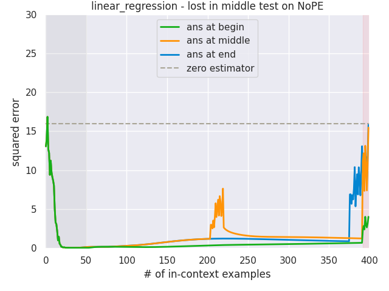

# master_thesis_DiNan_Lin_P76114723

## How Do Position Encodings Affect Length Generalization? Case Studies on In-Context Function Learning

Our codebase is based on the following repositories:

- [dtsip/in-context-learning](https://github.com/dtsip/in-context-learning)
- [Supplementary material from Bhattamishra et al.](https://openreview.net/forum?id=ekeyCgeRfC)

Repo structure:

```bash
┌── requirements.txt
├── configs
│   ├── base_model/     # Different size of backbone models
│   ├── hyperparams/    # Settings for culriculum learning and training
│   ├── logging/        # Wandb logging settings
│   ├── patch/          # Settings for selecting position encoding
│   ├── tasks/          # 
│   └── toy_task.yaml   # For testing environment
│
├── models              # Will be generated after training
│   └── task_name
│       └── input_dim
│           └── run_date
│               └── uid
│
├── paper/AAAI-25
│   └── AnonymousSubmission
│
├── thesis
│   ├── oral_defense.ppt
│   ├── oral_defense.pdf
│   ├── thesis.tex
│   └── thesis.bib
│
├── eval_atk.py
├── eval_atk.sh         # Refer to README.md $3.3
├── eval_attn.py
├── eval_attn.sh        # Refer to README.md $3.2
├── eval.sh             # Refer to README.md $3.1
├── train.py
├── train.sh            # Refer to README.md $2
├── .gitignore
└── README.md
```

## 0. Environment

### Hardware and Driver

- Ubuntu 22.04
- RTX 3060 12GB
- CUDA 12.1

### Dependency

- Python 3.11.*
- Pytorch 2.3.1 + CUDA 12.1
- We use [pipreqs](https://github.com/bndr/pipreqs) for generating `requirements.txt`. Please create a new environment and install all packages.

## 1. Data Generation

SOURCE CODE: [`src/samplers.py`](src/samplers.py)

Since our method needs fresh data for each training step, we do not have a fixed dataset. We generate data on-the-fly during training.

You can refer to the training file [`train.py`](train.py#L110) for the data generation process.

```python
# Generate data
xs = task.sample_xs(
    self.curriculum.n_points,
    self.batch_size,
    self.curriculum.n_dims_truncated,
)
ys = task.evaluate(xs)
```

## 2. Training

### Edit Config Files

All of our config files are under 'configs/' folder. Here is an [example](configs/tasks/linear_regression/alibi.yaml) of training for Linear Regression with ALiBi.

```yaml
model:
  !include ../../base_model/llama/standard.yaml

patch:
  !include ../../patch/alibi/alibi.yaml

task:
  data: gaussian
  name: linear_regression
  curriculum: 
    !include ../../hyperparams/curriculum/dim-20_pts-50.yaml

training:
  !include ../../hyperparams/training_args.yaml

wandb:
  !include ../../logging/wandb.yaml
```

Details of each line:

- model: choose the backbone model. We only report the results of Llama in the paper.
- patch: choose the position encoding.
- task: please refer other config files for different tasks.
- training: our training hyperparameters.
- wandb: logging configuration. Default is offline so you can ignore this.

For the default settings, just simply run the training script:

```bash
bash train.sh
```

Our pipeline will save the checkpoint (state.pt) and config file (config.yaml) at `models/$task_name$/$input_dim$/$run_date$/uid`

If you want to modify `train.sh` for other tasks, here is all options.

```bash
run_task=("linear_regression" "sparse_linear_regression" "cnf" "conjunction" "disjunction" "dnf" "int_halfspace" "majority" "parity" "sparse_disjunction" "sparse_parity" "sparse_thres")
run_pe=("alibi" "dynamic_yarn" "fire" "nope" "rope" "yarn" "mamba")
```

## 3. Evaluation and Analysis

### 3.1 Main Experiments from paper

Normally, training pipeline will also evaluate the model. If you want to re-evaluate specific model, please modify the `eval.sh` script and run:

```bash
bash eval.sh
```

The output files will be stored at `models/$task_name$/$input_dim$/$run_date$/uid/`

Example: `ood_length.png`



### 3.2 Discussion from thesis

#### (Thesis 5.1) Does Increasing Model Size Enhance Performance?

Please change the `model` field in the config file to `small` or `large` and run the training script.

```yaml
model:
  !include ../../base_model/llama/$model_size$.yaml # small.yaml or large.yaml
```

#### (Thesis 5.2) Can recency bias explain why Transformer fails?

Please make sure that the 'eval_date' field in bash file is correct and run:

```bash
bash eval_attn.sh
```

The output files will be stored at `models/$task_name$/$input_dim$/$run_date$/uid/duplicated`

Example: `avg_attention_score.png`



#### (Thesis 5.3) Does inductive bias exist in In-Context Function Learning?

Please make sure that the 'eval_date' field in bash file is correct and run:

```bash
bash eval_atk.sh
```

The output files will be stored at `models/$task_name$/$input_dim$/$run_date$/uid/duplicated`

Example: `baseline_all_dup.png`



#### (Thesis 5.4) Does serial-position effect exist in In-Context Function Learning?

Please make sure that the 'eval_date' field in bash file is correct and run:

```bash
bash eval_atk.sh
```

The output files will be stored at `models/$task_name$/$input_dim$/$run_date$/uid/duplicated`

Example: `lost_in_mid.png`



#### (Thesis 5.5) Will State Space Model Generalize on These Noise?

Our analysis experiment is based on Mamba architecture. Make sure all config files are modified the `model` field to `mamba` and run the training script.

```yaml
model:
  !include ../../base_model/mamba/standard.yaml
```

```bash
run_pe=("mamba")
```

Rerun all the evaluation process aforementioned, except for the attention related analysis.
